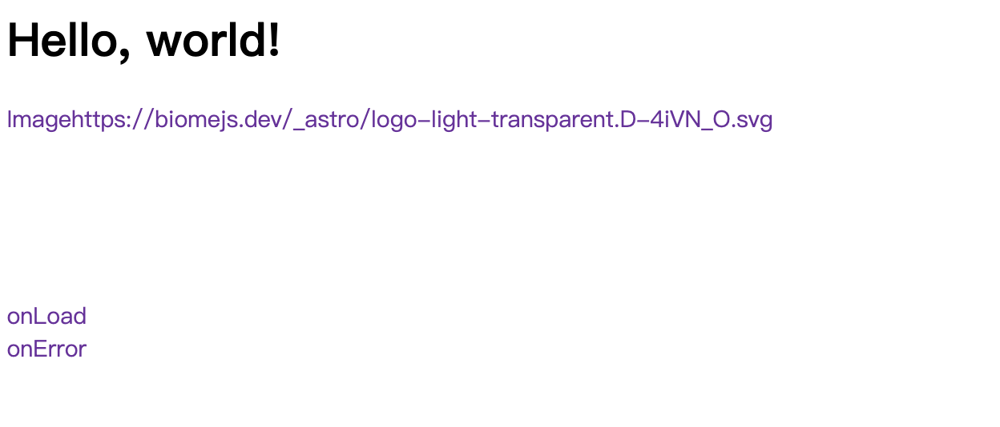
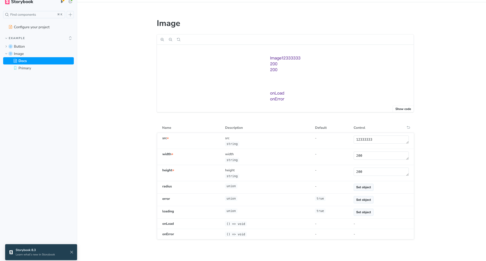

# react-component-library-template

This is a template to create a react component libraries with Vite

## Features

- React
- TypeScript
- Biome & Stylelint
- Storybook
- Vite
- Vitest
- Husky
- Commitizen

## Scripts

- "format": format the code
- "build": build the components
- "bump": bump a patch version
- "push:main": push history and tags
- "dev:demo": run the demo

- "dev:demo-dist": run the demo-dist
- "storybook": run the storybook

- "test:ui": run the vitest
